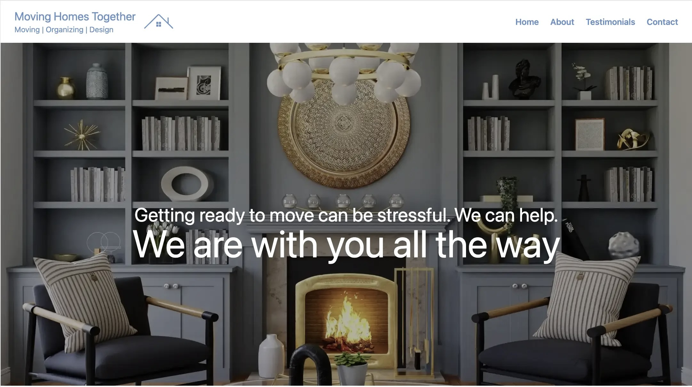

## Moving Homes Together Website

> A simple, professional website built with Astro.

## Overview
The Moving Homes Together website was built using a simple stack comprised of Astro and Tailwind. The site is nearly entirely static, with a small amount of vanilla JS used to create image parallax effects and mobile menu interactivity.
